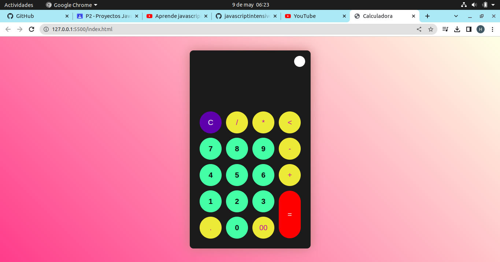
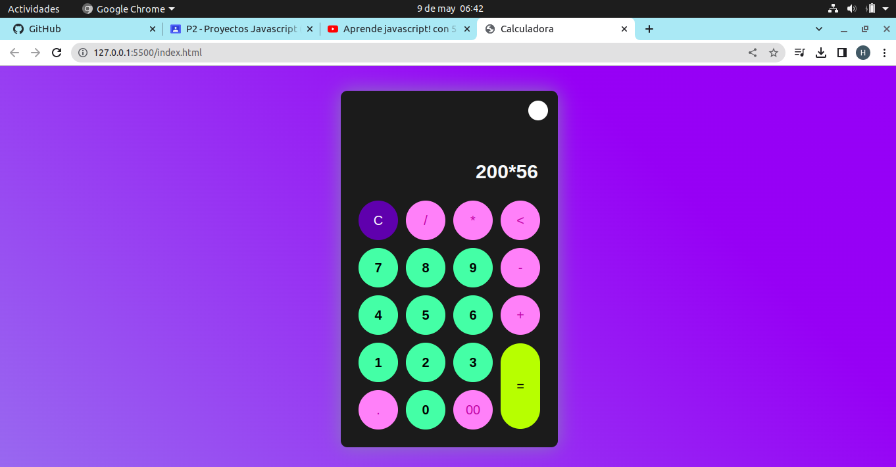
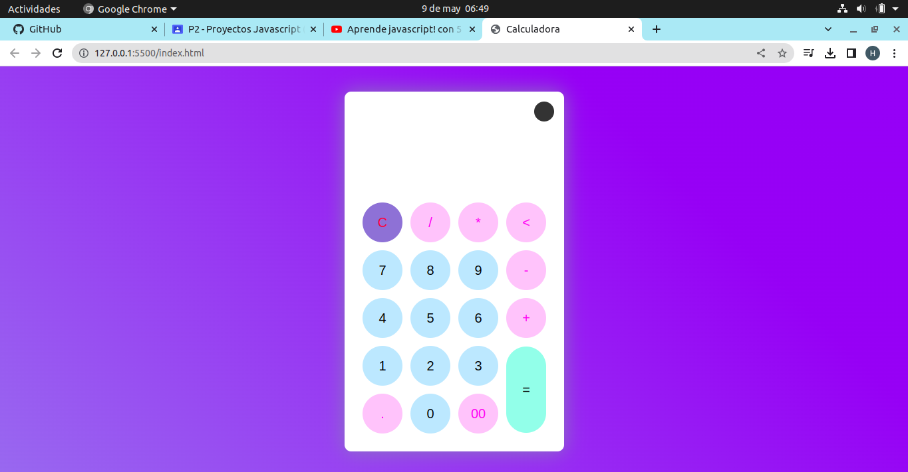

# En el desarrollo de la calculadora se puede ver las funciones de esta y sus resultados del funcionmieno.

# Con el css se puede cambiar colores del fondo o de los botones, se puede cambiar el diseño

# Con el theme toggler se puede hacer cambiar la calculadora de tonificación, de tema oscuro a claro o viseversa.
