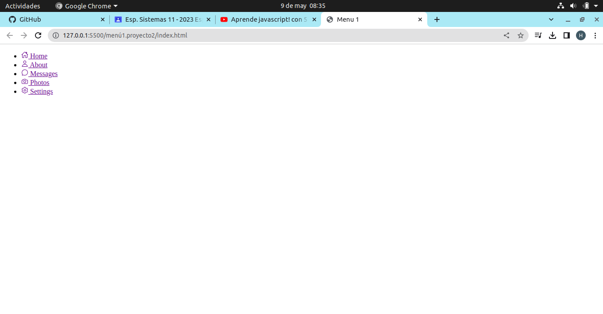
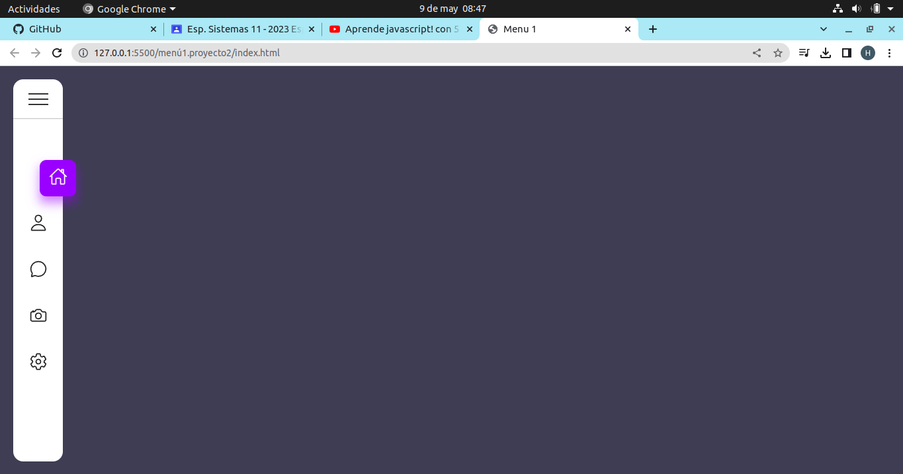
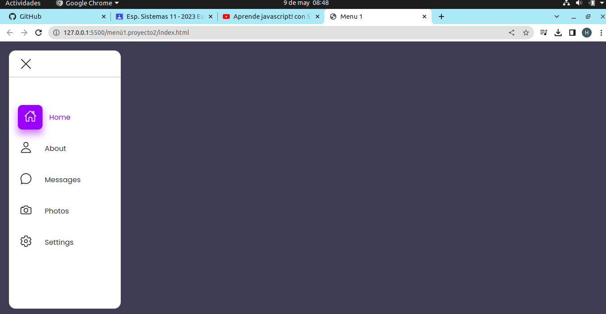

# La primera parte para diseñar el menú es sin el css que quedaría de la siguiente manera

# siguinte a eso se realiza la función de menú vertical desplegable y el diseño
 

# con la función "active" hacemos que el texto se pueda desplazar cunado querramos que el menú tenga la función de despliegue.

